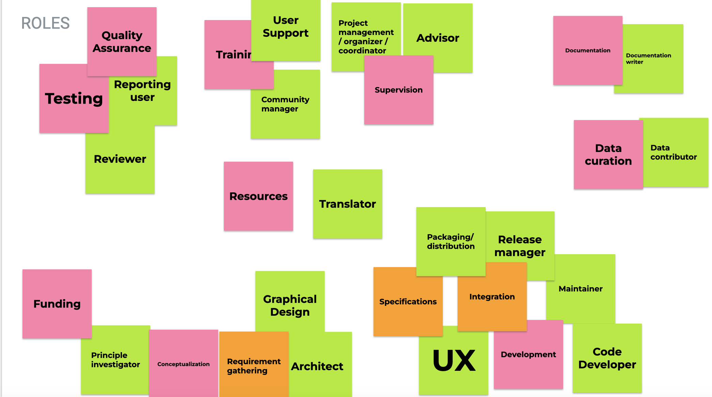

 
<!--
This website was created as a [hack day activity for the Collaborations Workshop 2023](https://www.software.ac.uk/cw23/hack-day) with the aim to define guidelines for authorship of software.

This activity is necessary because existing authorship guidelines, e.g., for papers, are not easily transferable to software.

The new guidelines will define:

- The importance of authorship specifically for software, taking into account:
    - The different authorship roles for software
    - Different contribution roles
    - The dynamic nature of software development, and different versions of what is perceived to be the “same thing”
- Who is a software author, specifically:
    - What criteria are for software authorship
    - How these criteria can be applied (giving examples)
- Who is a non-author contributor,
    - including example roles of contributors (eg raising bug issues, fixing typos)
    - including guidelines for how to identify when an contributor has transitioned to author, and when an author stops being an author
- When and how authors and contributors should be credited

This activity focuses on authorship of software (“the software itself”). It does not discuss specifics of authorship for related outputs (software papers, papers about software, etc.).
-->

Contents:

- [Software authorship](#authorship)
- [Roles in Software](#roles)
- [Guidelines for software projects](#guidelines)
- [How to get involved in SORTÆD?](#get-involved)

## Software authorship {#authorship}

## Roles in software {#roles}

{width=90%}

### Who is an author?

SORTÆD recommends that software authorship be based on substantial contributions to:

1. the conceptualization of the software; OR
2. the source code, documentation and metadata, test code, setup or build configuration of the software; OR
3. maintaining the software or safeguarding the continued existence or sustainability of the software project.<!-- E.g., project manager, governance, community manager -->

In contrast to authorship of textual research outputs: 

- software authorship is NOT based on approval of software versions to be released or published;
- software authorship is NOT based on agreeing to be accountable for contributions to the software beyond legal accountability, in ensuring that questions related to the quality and integrity of the software are appropriately investigated and resolved.

All those designated as authors should meet one of the three criteria for authorship, 
and all who meet one of the three criteria should be identified as authors.
Those who do not meet one of the four criteria due to the insubstantiality of their contribution
should be acknowledged as contributors (see below).
These authorship criteria are intended to reserve the status of authorship for those who deserve credit.

The responsibility for identifying who meets the authorship criteria lies is part of the governance of the software project.

If agreement cannot be reached about who qualifies for authorship, 
the legal owners of the software should be asked to investigate.     

### Non-author contributors

Contributions to software can be made in different roles.
Depending on the type of the contribution, contributors can be eligible for authorship if the contribution is substantial (see above).

Contributors who do not meet the above criteria for authorship should not be listed as authors, 
but they should be acknowledged. 
The roles that constitute contributorship are detailed in the following. 

### Software contributor role taxonomy

Supervision
 : _Coordinates the project effort, possibly across organizational boundaries_
 : Examples: Coordinator, project manager, advisor, team leader

 Resources
 : _Provision and maintenance of resources used and exposed by the software project, like computational infrastructure and cloud systems_
 : Examples: System administrator, cloud manager

 Funding
 : _Acquisition or management of funding for effort and events that sustain the software
 : Examples: Principal Investigator, work package leader

 Outreach
 : _Communication with end-users and stakeholders_
 : Examples: Training, community manager, user support

 Development
 : _Writing of the backend and frontend code as well as managing dependencies, making the software ready for release_
 : Examples: Programmer, maintainer, UX designer, release manager

 Data curation
 : _Integration of data in the software and ensures metadata is annotated and available_
 : Examples: Data provider, statician, data manager

 Testing
 : _Unit test, usability, integration tests, release test_
 : Examples: Reviewer, reporting user

 Documentation
 : _Writing of all documentation related to the software, including user guidelines, roadmapping_
 : Examples: Technical writer, metadata curator

 Conceptualisation
 : _Formulation of the idea and goals of the software, design of main features and functionalities_
 : Examples: Principal Investigator, Architect, graphical designer, release manager, requirement gathering

## Guidelines for software projects {#guidelines}
<!--
This section provides guidance for software projects looking to understand how to acknowledge authorship and contributors to their project
-->
### What do you need to do as a project? {#need}

As a research software project, it's useful to be clear and transparent who the authors of your software are, acknowledge contributors, and describe how decisions around authorship are made. 

- Authorship: the list of authors should be clearly stated, and ideally made available in a machine readable form as well (e.g. using CodeMeta). A preferred citation for the software project (e.g. in a CFF file) should be included to make it easy to give credit to the authors.  
- Contributors: people who have made useful contributions to a project should be acknowledged in documentation, and ideally in project metadata (e.g. in the DOI metadata or in a CodeMeta file).
- Governance: the way the project decides who is an author and who is a contributor should be transparently and publicly documented.

An appropriate place to put this information is in a contribution section in your README or a separate CONTRIBUTING file. There are good existing guidelines for how to structure a project README and CONTRIBUTING file.

### Frequently Asked Questions {#faq}

1. _What is the difference between a contributor and an author?_ A **contributor** is someone who has made a useful contribution to the project, through one or more of the different [contributor roles](#contributorroles). An **author** is someone who has made a more significant contribution to the project, as defined by the [authorship criteria](#authorshipcriteria).
2. _When does a contributor become an author?_ A contributor becomes an author, when the people involved in the project governance have decided they meet the criteria.
3. _When does an author stop being an author?_ Generally, authorship is removed when the persons contributions to the current version of the software project are no longer meeting the criteria for authhorship. This may be because the code they have written is no longer included in the release.
4. _Who should I include as an author?_ This will be different for each project, however we recommend the people involved in the governance of the project use the [authorship criteria](#authorshipcriteria) and comes up with a set of questions that can be used to assess the significance of someone's contributions. These may not just be contributions of lines of code, but the many other [roles](#contributorroles) that are important in the development of research software.

### Examples of use {#examples}

To be added.

### References {#references}

Some useful references:

- [CReDIT](https://onlinelibrary.wiley.com/doi/epdf/10.1002/leap.1210)
- [AllContributors](https://allcontributors.org/)
- [Contributor Roles Crosswalk](https://zenodo.org/record/4767798)
- [R citation roles](https://journal.r-project.org/articles/RJ-2012-009/). 
- [MARC relator codes](https://www.loc.gov/marc/relators/relaterm.html)
- [ROpenSci guidance](https://devguide.ropensci.org/collaboration.html?q=ctb#attributions)
- [SCoRO ontology](https://sparontologies.github.io/scoro/current/scoro.html)
- [Policy on acknowledging the contribution of LLM/AI](https://poldrack.github.io/talks-AIAssistedCoding/talk/talk.html#/title-slide also [this](https://poldrack.github.io/talks-AIAssistedCoding/talk/talk.html#/section-10) and [this](https://psyarxiv.com/b58ex)

## How to get involved in SORTÆD? {#get-involved}

### How to contribute? {#contribute}

If you would like to contribute to this project, please [open an issue](https://github.com/sdruskat/software-authorship/issues) and get in touch with us.

### How to become an author on this project? {#author}

To become an author on this project, please open an issue with a brief description of what you want to work on and we can discuss it.

### How to cite this project? {#cite}

Use ... to cite this project